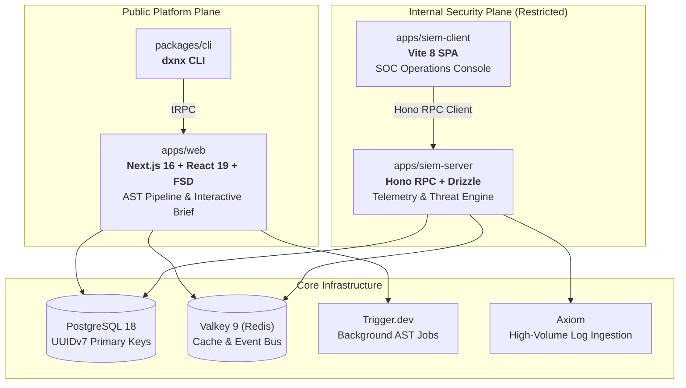

<div align="center">

<pre>
  ██████╗   ██████╗  ██╗  ██╗ ██╗   ██╗ ███╗   ██╗ ██╗ ██╗  ██╗
  ██╔══██╗ ██╔═══██╗ ╚██╗██╔╝ ╚██╗ ██╔╝ ████╗  ██║ ██║ ╚██╗██╔╝
  ██║  ██║ ██║   ██║  ╚███╔╝   ╚████╔╝  ██╔██╗ ██║ ██║  ╚███╔╝
  ██║  ██║ ██║   ██║  ██╔██╗    ╚██╔╝   ██║╚██╗██║ ██║  ██╔██╗
  ██████╔╝ ╚██████╔╝ ██╔╝ ██╗    ██║    ██║ ╚████║ ██║ ██╔╝ ██╗
  ╚═════╝   ╚═════╝  ╚═╝  ╚═╝    ╚═╝    ╚═╝  ╚═══╝ ╚═╝ ╚═╝  ╚═╝
</pre>

### Deterministic Codebase Intelligence & Contextual Architecture Navigation

**Understand complex repositories in minutes through interactive AST graphs and node-targeted AI.**

[](https://turbo.build)
[](https://bun.sh)
[](https://www.typescriptlang.org/)
[-24292e?style=flat-square&logo=postgresql)](https://postgresql.org)
[](https://biomejs.dev)
[](LICENSE)

[Architecture](#-system-architecture) · [Workspaces](#-workspaces--access-model) · [Quickstart](#-quickstart) · [Security](SECURITY.md)

</div>

---

## 🎯 The Philosophy

Most automated tools attempt to solve codebase comprehension by dumping thousands of files into an LLM context window. This approach results in slow responses, high token costs, and heavily hallucinated architecture assumptions.

**Doxynix takes an AST-first, deterministic approach:**

1. **Deterministic Extraction:** Native Tree-Sitter WASM parsers analyze the codebase structure locally, extracting exact symbols, imports, and call hierarchies.
2. **Topological Navigation:** The system computes entry points, cyclic dependencies, and domain boundaries, mapping them into an interactive visual canvas.
3. **Targeted AI Reasoning:** LLMs are invoked exclusively on the specific sub-graph or node you select, grounding their explanations strictly in verifiable code facts.

---

## 🏛️ System Architecture

Doxynix is engineered as a high-performance monorepo running on **Bun** and **Turborepo**. The architecture explicitly isolates public code intelligence services from restricted security operations.



---

## 📦 Workspaces & Access Model

| Workspace | Package | Role | Access Scope |
| :--- | :--- | :--- | :---: |
| [`apps/web`](apps/web) | `@doxynix/web` | Code intelligence portal, Interactive Repo Brief, AI pipeline | 🌐 **Public** |
| [`apps/siem-server`](apps/siem-server) | `@doxynix/siem-server` | Telemetry processing, security audit logging, Drizzle ORM | 🔒 **Internal (Admins)** |
| [`apps/siem-client`](apps/siem-client) | `@doxynix/siem-client` | Security operations dashboard, real-time incident console | 🔒 **Internal (Admins)** |
| [`packages/cli`](packages/cli) | `@doxynix/cli` | Terminal interface for developers and CI/CD runners | 🚧 **Public (MVP)** |
| [`packages/shared`](packages/shared) | `@doxynix/shared` | Shared Zod schemas, validation contracts, and domain types | 🔒 **Internal** |
| [`packages/config`](packages/config) | `@doxynix/config` | Shared configurations for Biome, TypeScript, and Oxlint | 🌐 **Shared** |

---

## 🚀 Quickstart

### Prerequisites

* **Bun** `>= 1.3.14` *(npm, yarn, and pnpm are strictly prohibited)*
* **Docker & Docker Compose**
* **Doppler CLI** *(optional, for remote secret management)*

### 1. Setup & Dependencies

```bash
# Clone the repository
git clone https://github.com/doxynix/doxynix.git
cd doxynix

# Install dependencies
bun install
```

### 2. Start Infrastructure

Launch PostgreSQL 18 and Valkey 9 in background containers:

```bash
docker compose up -d
```

### 3. Initialize Databases

Generate ORM clients (Prisma, ZenStack, Drizzle) and apply initial schema migrations:

```bash
bun run db:generate
bun run db:migrate
```

### 4. Run Development Cluster

Start all applications concurrently via the Turborepo TUI:

```bash
bun run dev
```

* **Web Platform:** `http://localhost:3000`
* **SIEM Core API:** `http://localhost:8080`
* **SIEM Dashboard:** `http://localhost:5173`

---

## 🛠️ Repository Commands

```bash
# Code Quality & Validation
bun run lint            # Check code style with Biome
bun run lint:fix        # Automatically fix lint violations
bun run type-check      # Strict TypeScript validation across all workspaces
bun run validate        # Full audit: Lint + Types + Architecture boundary checks
bun run secretlint      # Scan repository for leaked credentials
bun run knip            # Identify dead code and unused dependencies

# Automated Testing
bun run test            # Execute unit and integration tests (Vitest)
bun run test:stryker    # Run mutation testing suite

# Database Tooling
bun run db:generate     # Generate all database artifacts
bun run db:migrate      # Apply pending migrations across all environments
bun run db:studio       # Launch database administration interfaces
```

---

## 🛡️ Engineering Invariants

> [!IMPORTANT]  
> The monorepo enforces architectural constraints through automated CI checks and pre-commit hooks (`lefthook`). Violating these rules will result in rejected commits.

* **Strict App Isolation:** Applications inside `apps/*` cannot directly import each other. Shared logic must reside in `packages/*`.
* **Path Standard:** Path operations must use `pathe` (Node's native `path` is forbidden to ensure cross-platform safety).
* **Utility Standard:** Collection manipulations must use `es-toolkit`.
* **Database Layer:** All primary keys in SIEM use `UUIDv7` for chronological B-tree efficiency. The Web plane uses ZenStack access-control policies compiled directly into Prisma queries.

---

## 📄 License & Commercial Access

Doxynix is open-source under the **GNU Affero General Public License v3.0 (AGPL-3.0-only)**.

* **Open-Source Use:** Free for community, research, and non-commercial self-hosting under AGPLv3 terms.
* **Commercial Licensing:** To embed Doxynix into closed-source commercial workflows without copyleft obligations, contact [licensing@doxynix.space](mailto:licensing@doxynix.space).

<div align="center">
<sub>Crafted with ❤️ by the Doxynix Engineering Team.</sub>
</div>
