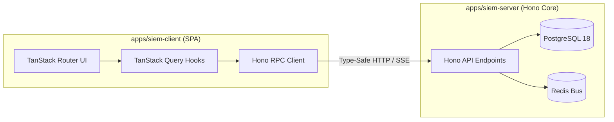

<div align="center">

# 📊 @doxynix/siem-client

### Real-Time SOC Console & Security Operations Dashboard

**Restricted: Internal operator console for Doxynix Security Analysts & Platform Administrators.**

[](https://vitejs.dev/)
[](https://react.dev/)
[](https://tanstack.com/router)
[](https://tailwindcss.com/)

[Responsibilities](#-system-responsibilities) · [FSD Architecture](#-fsd-layering--import-rules) · [Directory Layout](#-directory-structure) · [Workflow](#-development-workflow)

</div>

---

## 🎯 System Responsibilities

`apps/siem-client` is a dedicated Single Page Application (SPA) providing real-time visibility into security incidents, anomaly detections, audit logs, and live telemetry across the Doxynix platform.

### Key Capabilities

* **End-to-End Typed RPC Client:** Communicates with `@doxynix/siem-server` through a strongly-typed Hono RPC client (`hcWithType`), eliminating API schema divergence.
* **File-Based Type-Safe Routing:** Automated route-tree generation (`routeTree.gen.ts`) powered by TanStack Router with first-class search param validation.
* **High-Density Telemetry Charts:** Interactive time-series charts, anomaly timelines, and incident breakdowns built with Recharts.
* **Feature-Sliced Design (FSD):** Modular frontend architecture enforcing strict unidirectional dependencies.
* **Real-Time Stream Support:** Server-Sent Events (SSE) and WebSocket listeners for real-time threat feed updates.

---

## 🏗️ Data & Communication Flow



---

## 📐 FSD Layering & Import Rules

The application enforces strict **Feature-Sliced Design** conventions. Imports flow strictly downwards:
`routes` ➔ `widgets` ➔ `features` ➔ `entities` ➔ `shared`

```
src/
├── routes/               # File-based routes (__root.tsx, auth.tsx, index.tsx)
├── widgets/              # Composite layout widgets:
│   └── sidebar/          # Main navigation & system health indicator
├── features/             # Interactive domain capabilities:
│   ├── auth/             # Authentication & 2FA forms
│   └── scan/             # Security scanning triggers & parameter inputs
├── entities/             # Visual business entities:
│   └── incident/         # Incident cards, severity badges & status indicators
└── shared/               # Reusable primitives:
    ├── hooks/            # UI & window observer hooks
    ├── lib/              # Auth client, chart helpers, utility formatters
    └── ui/core/          # Accessible UI kit (buttons, charts, dialogs, drawers, tables)
```

> [!NOTE]  
> The file `src/routeTree.gen.ts` is managed automatically by the TanStack Router Vite plugin. Never modify this file manually.

---

## 🛠️ Development Workflow

Commands can be run from the monorepo root using Turbo filters, or directly within `/apps/siem-client`:

```bash
# Start Vite development server (port 5173)
bun run dev

# Run strict TypeScript typecheck
bun run type-check

# Compile production bundle
bun run build

# Preview production build locally
bun run preview

# Code Quality (Biome)
bun run lint               # Check for linting violations
bun run lint:fix           # Automatically fix linting issues
bun run format             # Format source code
bun run validate           # Run full Biome check
```

---

<div align="center">
<sub>Crafted with ❤️ by the Doxynix Engineering Team.</sub>
</div>
