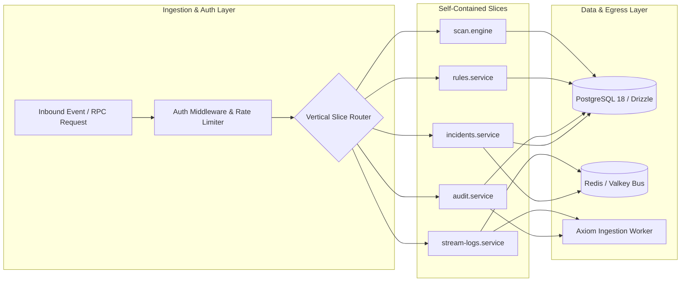

<div align="center">

# 🛡️ @doxynix/siem-server

### High-Throughput Security Telemetry, Ingestion & Audit Core

**Restricted: Internal infrastructure for Doxynix Security Analysts & Platform Administrators.**

[](https://hono.dev/)
[](https://orm.drizzle.team/)
[](https://ietf.org)
[](https://axiom.co)

[Architecture](#-vertical-slice-architecture) · [Directory Layout](#-directory-structure) · [Configuration](#-environment-configuration) · [Operations](#-operational-commands)

</div>

---

## 🎯 System Responsibilities

`apps/siem-server` is an isolated, high-throughput backend service responsible for streaming platform telemetry, auditing user and agent actions, evaluating security threat rules, and dispatching real-time incident events across the Doxynix ecosystem.

### Key Capabilities

* **Vertical Slice Architecture:** Domain slices (`incidents`, `audit`, `rules`, `scan`, `stream-logs`) are completely self-contained with zero cross-slice dependencies.
* **End-to-End Type Safety:** Exports `AppType` to provide a zero-cost, fully typed RPC client (`hcWithType`) for `@doxynix/siem-client`.
* **UUIDv7 Indexed Primary Keys:** Native time-sorted UUIDv7 identifiers optimized for high-volume PostgreSQL B-tree chronological indexing.
* **Axiom Batch Ingestion Worker:** Asynchronous, non-blocking telemetry forwarder that buffers and flushes security events directly into Axiom Datasets.
* **Redis Event Bus & Flood Protection:** High-speed queueing and distributed rate limiting to shield backend workers from log bursts.

---

## 🏛️ Vertical Slice Architecture



---

## 📁 Directory Structure

```
src/
├── core/
│   ├── auth/              # Better-Auth Drizzle adapter, schemas & role types
│   ├── axiom/             # Axiom batched ingestion worker & client instance
│   ├── db/                # Drizzle ORM schema, UUIDv7 helpers & pagination
│   ├── middleware/        # Session validation & RBAC authorization guards
│   ├── ratelimit.ts       # Sliding-window rate limiter via Redis/Valkey
│   └── redis.ts           # Redis client & event bus pub/sub provider
├── modules/
│   ├── admin/             # Administrator accounts & role assignment routers
│   ├── analytics/         # Security aggregations & incident trend calculations
│   ├── audit/             # Immutable platform-wide audit log pipeline
│   ├── incidents/         # Security incident lifecycle (CRUD, status, triage)
│   ├── rules/             # Anomaly detection & threat rule evaluator
│   ├── scan/              # Background vulnerability scanning engine & listener
│   └── stream-logs/       # SSE / WebSocket log streaming pipeline
├── client.ts              # Exported RPC Client definition (hcWithType)
└── index.ts               # Hono HTTP server & RPC router initialization
```

---

## ⚙️ Environment Configuration

All environment variables are validated at startup via `@t3-oss/env-core`:

| Variable | Type | Description |
| :--- | :---: | :--- |
| `DATABASE_URL` | `URL` | PostgreSQL 18 connection string |
| `REDIS_URL` | `URL` | Valkey/Redis instance URL for pub/sub and rate limiting |
| `BETTER_AUTH_URL` | `URL` | Base authentication URL (`http://localhost:8080`) |
| `CLIENT_URL` | `String` | Comma-separated allowed CORS origins (`http://localhost:5173`) |
| `AXIOM_TOKEN` | `String` | Axiom API token for structured log ingestion |
| `AXIOM_DATASET` | `String` | Target telemetry dataset name in Axiom |
| `INITIAL_ADMIN_EMAIL` | `Email` | Bootstrap superadministrator email address |
| `INITIAL_ADMIN_PASSWORD` | `String` | Bootstrap superadministrator initial password |

---

## 🛠️ Operational Commands

Execute commands from the monorepo root using Turbo filters, or directly within `/apps/siem-server`:

```bash
# Start the server in watch mode (with Doppler secrets)
bun run dev

# Run strict TypeScript typechecking
bun run type-check

# Drizzle ORM Schema Management
bun run db:generate        # Generate SQL migration files from schema
bun run db:migrate         # Apply pending migrations to PostgreSQL 18
bun run db:studio          # Open Drizzle Studio database UI

# Seed Security Data & Administration
bun run seed:admin         # Bootstrap the initial superadministrator account
bun run db:seed:rules      # Populate baseline threat detection rules

# Code Quality (Biome)
bun run lint               # Run Biome linter check
bun run lint:fix           # Automatically fix lint issues
bun run format             # Format source files
```

---

<div align="center">
<sub>Crafted with ❤️ by the Doxynix Engineering Team.</sub>
</div>
