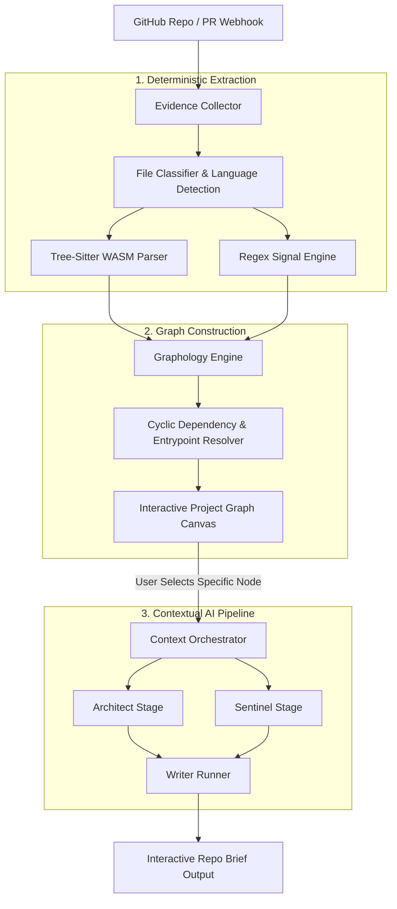

<div align="center">

# @doxynix/web

### Code Intelligence, Interactive Repo Brief & AST Analysis Core

**The primary public platform for deterministic codebase exploration and context-grounded AI documentation.**

[](https://nextjs.org/)
[](https://react.dev/)
[](https://feature-sliced.design/)
[](https://zenstack.dev/)
[](https://tree-sitter.github.io/)

[Pipeline](#-analysis-pipeline-architecture) · [FSD Structure](#-architectural-layers-fsd) · [Configuration](#-environment-configuration) · [Workflow](#-development-workflow)

</div>

---

## 🎯 System Responsibilities

`apps/web` is the user-facing web application and primary compute layer for repository intelligence. It processes GitHub repositories and Pull Requests by combining deterministic syntax tree parsing with context-isolated AI reasoning.

### Key Capabilities

* **Multi-Grammar AST Parsing:** Native `web-tree-sitter` (WASM) grammar execution extracts language-level symbols, interfaces, call trees, and import hierarchies without external network dependencies.
* **Interactive Topological Canvas:** Builds directed dependency graphs (`graphology` + `@xyflow/react`) to expose application entrypoints, isolated subgraphs, and cyclic dependencies.
* **Specialized AI Pipeline:**
  * `Architect Stage`: Computes high-level domain boundaries and cross-module workflows.
  * `Sentinel Stage`: Audits security invariants, auth guards, and sensitive sink paths.
  * `Writer Stage`: Generates contextual documentation anchored strictly to the selected node.
* **Database-Level Access Policies:** ZenStack (`schema.zmodel`) compiles row-level security and ownership rules directly into Prisma queries.
* **Enterprise Auth & Cryptography:** Better-Auth (GitHub, Google, Yandex, WebAuthn Passkeys) with field-level encryption for sensitive access tokens via `prisma-field-encryption`.

---

## 🔬 Analysis Pipeline Architecture



---

## 📁 Architectural Layers (FSD)

The application strictly enforces **Feature-Sliced Design (FSD)** across client and server boundaries:

```
src/
├── app/                  # Next.js App Router (internationalized routes [locale], API routes)
├── entities/             # Business models & display cards (repo, pr, api-keys, audit-log, user)
├── features/             # Interactive user workflows:
│   ├── repo-map/         # Interactive XYFlow canvas, layout hotkeys & node inspector
│   ├── repo-code-viewer/ # CodeMirror 6 editor, AST symbol search & live diffs
│   ├── repo-setup/       # Analysis trigger flows & live WebSocket terminal logs
│   └── agent/            # Contextual AI dialogue & tool-calling indicators
├── widgets/              # Composite UI blocks (app-header, app-sidebar, dashboard-stats, landing)
├── server/               # Server-only domain execution layer:
│   ├── core/             # DB client, Redis cache, GitHub App SDK, Better-Auth runtime
│   ├── modules/          # Business logic slices (analysis, agent, audit-logs, repos, webhooks)
│   └── utils/            # AST adapters, tokenizers, sanitizers, and circuit breakers
└── shared/               # Reusable UI primitives, tRPC clients, hooks, and utility libraries
```

---

## ⚙️ Environment Configuration

All environment variables are validated at startup via `@t3-oss/env-nextjs`.

| Variable | Type | Description |
| :--- | :---: | :--- |
| `DATABASE_URL` | `URL` | PostgreSQL 18 connection pool string |
| `REDIS_TCP_URL` | `URL` | Valkey/Redis instance URL for caching and rate limiting |
| `BETTER_AUTH_SECRET` | `String` | Cryptographic secret for signing session tokens |
| `BETTER_AUTH_URL` | `URL` | Base canonical application URL (`http://localhost:3000`) |
| `GITHUB_APP_ID` | `Number` | GitHub App ID for Octokit authenticated operations |
| `GITHUB_APP_PRIVATE_KEY` | `String` | GitHub App PEM certificate string |
| `GITHUB_WEBHOOK_SECRET` | `String` | Webhook verification HMAC secret |
| `GOOGLE_GENERATIVE_AI_API_KEY` | `String` | API key for Gemini architectural reasoning pipeline |
| `PRISMA_FIELD_ENCRYPTION_KEY` | `String` | 32-byte key used for field-level encryption at rest |
| `ABLY_API_KEY` | `String` | Real-time WebSocket token for streaming live AST build logs |

---

## 🛠️ Development Workflow

Run commands from the monorepo root using Turbo filters, or directly inside `/apps/web`:

```bash
# Start Next.js in development mode (with Doppler secrets)
bun run dev

# Start development with a constrained memory budget (2048 MB)
bun run dev:fast

# Compile ZenStack models and generate Prisma SQL client
bun run db:generate

# Execute pending migrations against the local PostgreSQL 18 instance
bun run db:migrate

# Run test suites
bun run test:unit       # Isolated unit tests (Vitest)
bun run test:int        # Database integration tests (Vitest)
bun run test:e2e        # End-to-end browser tests (Playwright)

# Validate FSD dependency rules and architectural boundaries
bun run arch:check
```

---

<div align="center">
<sub>Crafted with ❤️ by the Doxynix Engineering Team.</sub>
</div>
