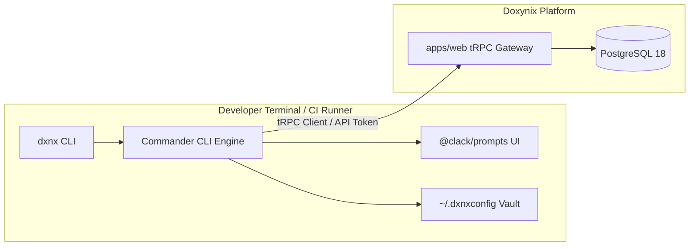

<div align="center">

# ⌨️ @doxynix/cli (`dxnx`)

### The Official Command-Line Interface for the Doxynix Ecosystem

**Early Access / MVP: Developer companion for terminal workflows and CI/CD pipelines.**

[](https://www.npmjs.com)
[](https://www.typescriptlang.org/)
[](https://github.com/natemoo-re/clack)
[](https://github.com/vercel/ncc)

[Capabilities](#-capabilities) · [Installation & Linking](#-installation--local-build) · [Usage](#-usage--commands) · [Security](#-token-storage--security)

</div>

---

## 🎯 Capabilities

The `dxnx` CLI brings Doxynix intelligence directly into developer terminals and CI/CD runners:

* **Secure Credential Storage:** Persists encrypted platform API tokens in a localized user config with strict filesystem permissions (`0o600`).
* **Profile Verification:** Inspects authenticated user metadata, role assignments, and accessible organization workspaces.
* **Pipeline Automation (Roadmap):** Triggers deterministic AST analysis during CI/CD checks and comments the generated Interactive Repo Brief directly onto GitHub Pull Requests.

---

## 🏗️ Architecture & Stack



---

## 📦 Installation & Local Build

The CLI is compiled into a self-contained, minified single-file executable using `@vercel/ncc`:

```bash
# 1. Compile standalone binary
bun run --filter @doxynix/cli build

# 2. Link binary globally to your system PATH
cd packages/cli && bun link

# 3. Verify global availability
dxnx --version
```

---

## 💻 Usage & Commands

```bash
# Display help and available command list
dxnx --help

# Verify the currently authenticated profile
dxnx profile

# (Upcoming) Trigger local repository analysis
dxnx scan --repo ./path-to-project
```

---

## 🔒 Token Storage & Security

To prevent unauthorized token exposure on shared developer machines and build runners:

* **Storage Location:** `~/.dxnxconfig`
* **Filesystem Permissions:** `0o600` (Read/write access is restricted exclusively to the file owner).
* **Sanitization:** Tokens are passed directly in HTTP authorization headers without disk leakage into shell history.

---

## 🛠️ Development

Run commands from the monorepo root or inside `/packages/cli`:

```bash
# Run CLI directly in watch mode with Bun
bun run dev

# Compile standalone production bundle
bun run build
```

---

<div align="center">
<sub>Crafted with ❤️ by the Doxynix Engineering Team.</sub>
</div>
