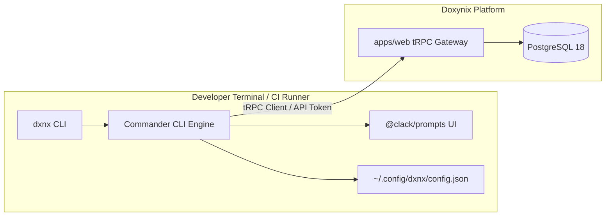

<div align="center">

# ⌨️ @doxynix/cli (`dxnx`)

### The Official Command-Line Interface for the Doxynix Ecosystem

**Early Access / MVP: Developer companion for terminal workflows and CI/CD pipelines.**

[](https://www.npmjs.com)
[](https://www.typescriptlang.org/)
[](https://github.com/natemoo-re/clack)
[](https://tsup.egoist.dev/)

[Capabilities](#-capabilities) · [Architecture](#-architecture--stack) · [Installation & Linking](#-installation--local-build) · [Usage](#-usage--commands) · [Security](#-token-storage--security)

</div>

---

## 🎯 Capabilities

The `dxnx` CLI brings Doxynix intelligence directly into developer terminals and CI/CD runners:

* **Secure XDG Credential Storage:** Persists platform API tokens in `~/.config/dxnx/config.json` (`0o600`).
* **AI Agent & Multi-Turn REPL:** Interactive assistant for refactoring, AST audits, and security fixes.
* **PR Analysis & Cloud Staging:** Direct review findings inspection, automated Pull Request creation, and inline review comments.
* **Deterministic Code Analysis:** Trigger repository and file-level AST indexing directly from the console.

---

## 🏗️ Architecture & Stack



---

## 📦 Installation & Local Build

The CLI is bundled using `tsup` into a self-contained executable:

```bash
# 1. Compile standalone bundle via tsup
bun run --filter @doxynix/cli build

# 2. Link binary globally to your system PATH
cd packages/cli && bun link

# 3. (Optional) Compile standalone single-file binary with Bun
bun run build:bin

# 4. Verify global availability
dxnx --help
```

---

## 💻 Usage & Commands

```bash
# Display help and complete command list
dxnx --help

# Authenticate with the Doxynix platform
dxnx auth login

# Check authenticated profile status
dxnx profile

# Trigger repository AST analysis
dxnx analyze

# Review and inspect pull request findings
dxnx pr review

# Start interactive AI assistant REPL
dxnx agent
```

### Available Command Domains

* `auth`: Login, logout, session management, and credential status.
* `analyze`: Trigger and stream codebase AST analysis.
* `repos`: List, inspect, and link connected repositories.
* `pr`: Pull Request analysis, review feedback, and automated fixes.
* `agent`: Context-grounded terminal REPL with tool-calling capabilities.
* `docs`: Generate and inspect documentation cards and project maps.
* `keys`: API key management (generate, inspect, revoke).
* `audit`: View platform audit logs and security events.
* `analytics`: Retrieve repository health, score metrics, and trends.
* `notifications`: Fetch and manage platform notifications.
* `staging`: Manage PR staging branches and cloud previews.
* `system`: Health status and gateway ping checks.

---

## 🔒 Token Storage & Security

To prevent unauthorized token exposure on shared developer machines and build runners:

* **Storage Location:** `~/.config/dxnx/config.json`
* **Filesystem Permissions:** `0o600` (Read/write access is restricted exclusively to the file owner).
* **Sanitization:** Tokens are passed directly in HTTP authorization headers without disk leakage into shell history.

---

## 🛠️ Development

Run commands from the monorepo root or inside `/packages/cli`:

```bash
# Run CLI directly in watch mode with Bun
bun run dev

# Compile production bundle
bun run build
```

---

<div align="center">
<sub>Crafted with ❤️ by the Doxynix Engineering Team.</sub>
</div>
